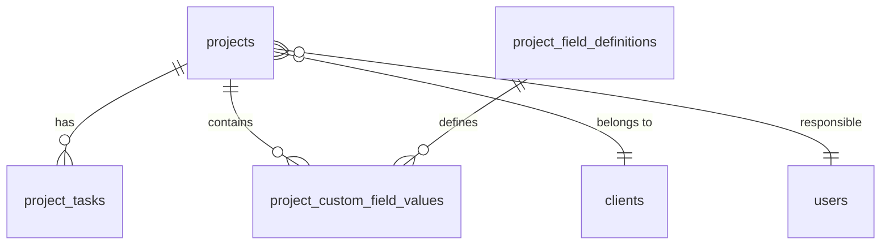

# Arquitectura del Sistema: NEXA-Sys V.02 CRM

## 1. Visión General
La arquitectura de NEXA-Sys V.02 está diseñada como una evolución hacia microservicios, comenzando como un **Monolito Modular** dockerizado. Esto permite una implementación rápida manteniendo la separación de dominios necesaria para el desacoplamiento futuro.

### 1.1 Diagrama de Alto Nivel
```mermaid
graph TD
    Client[Cliente Web (React + Vite)] -->|REST/JSON| Gateway[API Gateway / Nginx]
    Gateway -->|Forward| Backend[Backend Service (Node.js/Express)]
    Backend -->|SQL| DB[(PostgreSQL)]
```

### 1.2 Historial de Versiones
| Versión | Fecha | Cambios Principales |
|---------|-------|---------------------|
| 2.0 | 2026-01-03 | BUG #025/026: Metadatos de Proyecto y Administrador de Campos |
| 1.0 | 2025-12-30 | Fase 4 base: Proyectos, Tasks, Custom Fields |

## 2. Stack Tecnológico
- **Frontend**: React 18, Vite, CSS Modules (Vanilla + Variables), Context API para estado.
- **Backend**: Node.js, Express, `pg` (node-postgres) para acceso directo optimizado a datos.
- **Base de Datos**: PostgreSQL 15+.
- **Infraestructura**: Docker & Docker Compose.

## 3. Modelo de Datos (Esquema Relacional)

### 3.1 Core (Fases 1-2)
- **users**: `id`, `username`, `email`, `password_hash`, `role` (admin/manager/user), `active`, `created_at`.

### 3.2 Gestión de Clientes (Fase 3 - Referencia)
- **clients**: `id`, `name`, `email`, `phone`, `company`, `status`, `created_at`.
- **client_field_definitions**: Definiciones de campos dinámicos para clientes.
- **client_field_values**: Valores de dichos campos.

### 3.3 Gestión de Proyectos (Fase 4 + BUG #025/026)
Este módulo introduce la capacidad de gestionar proyectos vinculados a clientes y tareas, con soporte para campos personalizados definidos por el administrador y metadatos de negocio críticos.

#### Tablas del Módulo de Proyectos

**1. projects**
Tabla principal de proyectos con metadatos de negocio (BUG #025 FIX).
```sql
CREATE TABLE projects (
    id SERIAL PRIMARY KEY,
    client_id INTEGER REFERENCES clients(id) ON DELETE CASCADE,
    name VARCHAR(255) NOT NULL,
    description TEXT,
    status VARCHAR(50) DEFAULT 'prospectado', -- 'prospectado', 'cotizado', 'en_progreso', 'pausado', 'finalizado'
    start_date DATE,
    end_date DATE,
    responsible_id UUID REFERENCES users(id),
    -- BUG #025 FIX: Nuevos campos de metadatos de negocio
    budget DECIMAL(12, 2),           -- Presupuesto estimado del proyecto
    priority VARCHAR(20) DEFAULT 'medium',  -- 'high', 'medium', 'low'
    progress_percentage INTEGER DEFAULT 0,  -- Porcentaje de avance (0-100)
    --
    custom_data JSONB DEFAULT '{}'::jsonb, -- Stores values for custom fields
    created_at TIMESTAMP DEFAULT CURRENT_TIMESTAMP,
    updated_at TIMESTAMP DEFAULT CURRENT_TIMESTAMP,
    deleted_at TIMESTAMP NULL -- Soft Delete
);
```

**2. project_tasks**
Gestión del workflow de tareas dentro de un proyecto.
```sql
CREATE TABLE project_tasks (
    id SERIAL PRIMARY KEY,
    project_id INTEGER REFERENCES projects(id) ON DELETE CASCADE,
    description TEXT NOT NULL,
    status VARCHAR(50) DEFAULT 'pendiente', -- 'pendiente', 'en_progreso', 'completada', 'aprobada'
    assigned_to UUID REFERENCES users(id),
    created_by UUID REFERENCES users(id),
    approved_by UUID REFERENCES users(id), -- Auditoría de quién aprobó
    approved_at TIMESTAMP NULL,
    created_at TIMESTAMP DEFAULT CURRENT_TIMESTAMP,
    updated_at TIMESTAMP DEFAULT CURRENT_TIMESTAMP
);
```

**3. project_field_definitions**
Metadatos de los campos personalizados que los Admins pueden crear (BUG #026).
```sql
CREATE TABLE project_field_definitions (
    id SERIAL PRIMARY KEY,
    name VARCHAR(100) NOT NULL UNIQUE,       -- Internal key (e.g., 'repo_url')
    label VARCHAR(255) NOT NULL,             -- Display label (e.g., 'URL Repositorio')
    type VARCHAR(50) NOT NULL,               -- 'text', 'number', 'date', 'url', 'email', 'select', 'multiselect', 'textarea', 'checkbox'
    category VARCHAR(100) DEFAULT 'General', -- 'General', 'Técnico', 'Gestión', 'Agile', 'Financiero'
    options TEXT[],                          -- For select/multiselect: 'React;Vue;Angular'
    is_required BOOLEAN DEFAULT FALSE,       -- Campo obligatorio
    sort_order INTEGER DEFAULT 0,            -- Orden de presentación
    active BOOLEAN DEFAULT TRUE,             -- Soft delete
    created_at TIMESTAMP DEFAULT CURRENT_TIMESTAMP
);
```

**4. project_custom_field_values**
Valores reales de los campos personalizados para cada proyecto.
```sql
CREATE TABLE project_custom_field_values (
    definition_id INTEGER REFERENCES project_field_definitions(id) ON DELETE CASCADE,
    project_id INTEGER REFERENCES projects(id) ON DELETE CASCADE,
    value TEXT, -- Se castea según field_type en aplicación
    PRIMARY KEY (definition_id, project_id)
);
```

### 3.4 Relación entre Tablas


## 4. API Rest (Endpoints)

### 4.1 Proyectos
| Método | Endpoint | Descripción | Rol Requerido |
|--------|----------|-------------|---------------|
| GET | `/api/projects` | Listado con filtros (status, client) | Autenticado |
| GET | `/api/projects/:id` | Detalle completo + Tareas + Custom Fields | Autenticado |
| POST | `/api/projects` | Crear proyecto | Admin/Manager |
| PUT | `/api/projects/:id` | Actualizar datos + metadatos + custom fields | Admin/Manager |
| DELETE | `/api/projects/:id` | Soft delete | Admin |

### 4.2 Tareas
| Método | Endpoint | Descripción | Rol Requerido |
|--------|----------|-------------|---------------|
| POST | `/api/projects/:id/tasks` | Crear tarea | Autenticado |
| PUT | `/api/projects/tasks/:taskId/status` | Cambiar estado | Autenticado (Admin/Manager para aprobar) |

### 4.3 Campos Personalizados - Configuración (BUG #026 FIX)
| Método | Endpoint | Descripción | Rol Requerido |
|--------|----------|-------------|---------------|
| GET | `/api/projects/meta/fields` | Obtener definiciones activas | Admin/Manager |
| GET | `/api/projects/meta/fields/all` | Obtener todas las definiciones | Admin |
| POST | `/api/projects/meta/fields` | Crear nueva definición | Admin |
| PUT | `/api/projects/meta/fields/:id` | Actualizar definición | Admin |
| DELETE | `/api/projects/meta/fields/:id` | Desactivar definición (soft delete) | Admin |

### 4.4 Carga de Proyectos con Metadatos
**GET /api/projects** ahora retorna:
```json
{
  "id": 1,
  "name": "Migración Cloud",
  "client_id": 1,
  "client_name": "Corp. Alfa",
  "description": "...",
  "status": "en_progreso",
  "start_date": "2025-01-15",
  "end_date": "2025-06-30",
  "responsible_id": "uuid-...",
  "responsible_name": "Juan Pérez",
  "budget": 45000.00,
  "priority": "high",
  "progress_percentage": 35,
  "custom_data": {},
  "created_at": "2025-01-01T00:00:00Z"
}
```

## 5. Arquitectura Frontend

### 5.1 Estructura de Componentes
```
src/
├── pages/
│   └── Projects/
│       ├── ProjectsList.jsx      # Listado + Modal de creación/edición
│       ├── ProjectDetail.jsx     # Vista detalle con tabs
│       └── ProjectFieldManager.jsx  # BUG #026: Admin de campos personalizados
├── components/
│   ├── KanbanBoard.jsx
│   └── ProjectModal.jsx          # BUG #025: Modal unificado con metadatos
├── services/
│   └── api.js                    # projectsAPI con nuevos métodos
└── hooks/
    └── useProjects.js            # Hook para lógica de proyectos
```

### 5.2 Componentes Nuevos (BUG #025/026 FIX)

#### ProjectModal.jsx
Modal unificado para creación/edición de proyectos con metadatos de negocio.
- **Campos del formulario**:
  - Información básica: Nombre, Cliente, Estado
  - **Metadatos de negocio (BUG #025)**:
    - Presupuesto estimado (currency)
    - Prioridad (high/medium/low)
    - Responsable (dropdown de usuarios)
    - Fecha inicio/fin
    - Porcentaje avance
  - Campos personalizados dinámicos (desde `project_field_definitions`)

#### ProjectFieldManager.jsx
Administrador de campos personalizados para proyectos (similar a ClientManagement).
- **Funcionalidades**:
  - Listado de campos activos/inactivos
  - Creación de nuevos campos
  - Edición de campos existentes
  - Activar/desactivar campos (soft delete)
  - Reordenar campos (sort_order)

### 5.3 Patrón de Campos Personalizados (igual que ClientManagement)
```javascript
// Fetch de campos definidos
const fields = await projectsAPI.getFields();

// Agrupar por categoría
const groupedFields = fields.reduce((acc, field) => {
    if (!field.active) return acc;
    const cat = field.category || 'General';
    if (!acc[cat]) acc[cat] = [];
    acc[cat].push(field);
    return acc;
}, {});

// Renderizado dinámico
{Object.entries(groupedFields).map(([category, catFields]) => (
    <div key={category}>
        <h4>{category}</h4>
        {catFields.map(field => (
            <input
                type={field.type}
                value={formData.custom_data[field.name] || ''}
                onChange={e => setFormData({
                    ...formData,
                    custom_data: { ...formData.custom_data, [field.name]: e.target.value }
                })}
            />
        ))}
    </div>
))}
```

## 6. Seguridad
- **Middlewares**:
  - `verifyToken`: En todas las rutas `/api/projects`.
  - `requireRole(['admin', 'manager'])`: Para `POST/PUT/DELETE` proyectos, tareas y campos personalizados.
  - `softDeleteFilter`: Excluye registros con `deleted_at IS NOT NULL`.

## 7. Migración para BUG #025/026

### 7.1 Script de Migración PostgreSQL
```sql
-- Agregar campos faltantes a projects (BUG #025)
ALTER TABLE projects
ADD COLUMN IF NOT EXISTS budget DECIMAL(12, 2),
ADD COLUMN IF NOT EXISTS priority VARCHAR(20) DEFAULT 'medium',
ADD COLUMN IF NOT EXISTS progress_percentage INTEGER DEFAULT 0;

-- Actualizar project_field_definitions (BUG #026)
ALTER TABLE project_field_definitions
ADD COLUMN IF NOT EXISTS label VARCHAR(255) NOT NULL DEFAULT 'Untitled',
ADD COLUMN IF NOT EXISTS category VARCHAR(100) DEFAULT 'General',
ADD COLUMN IF NOT EXISTS is_required BOOLEAN DEFAULT FALSE,
ADD COLUMN IF NOT EXISTS sort_order INTEGER DEFAULT 0,
ADD COLUMN IF NOT EXISTS options TEXT[];

-- Actualizar tipos de datos existentes
ALTER TABLE project_field_definitions
ALTER COLUMN name TYPE VARCHAR(100),
ALTER COLUMN type TYPE VARCHAR(50);
```

## 8. Contrato de API - Detalle

### 8.1 Endpoints de Campos Personalizados (NUEVO)

#### GET /api/projects/meta/fields
```json
// Response
[
  {
    "id": 1,
    "name": "repo_url",
    "label": "URL del Repositorio",
    "type": "url",
    "category": "General",
    "is_required": false,
    "sort_order": 1,
    "options": null,
    "active": true
  },
  {
    "id": 2,
    "name": "tech_stack",
    "label": "Stack Tecnológico",
    "type": "multiselect",
    "category": "Técnico",
    "is_required": false,
    "sort_order": 2,
    "options": ["React", "Vue", "Angular", "Node.js"],
    "active": true
  }
]
```

#### POST /api/projects/meta/fields
```json
// Request Body
{
  "name": "sprint_actual",
  "label": "Sprint Actual",
  "type": "number",
  "category": "Agile",
  "is_required": false,
  "sort_order": 5,
  "options": null
}

// Response (201 Created)
{ "message": "Campo creado exitosamente" }
```

#### PUT /api/projects/meta/fields/:id
```json
// Request Body
{
  "label": "URL del Repositorio (Actualizado)",
  "category": "Desarrollo",
  "is_required": true,
  "sort_order": 3
}

// Response (200 OK)
{ "message": "Campo actualizado exitosamente" }
```

## 9. Validaciones

### 9.1 Validaciones del Frontend
- **Prioridad**: Solo valores 'high', 'medium', 'low'
- **Porcentaje**: Entero entre 0 y 100
- **Presupuesto**: Decimal positivo
- **Fechas**: start_date <= end_date

### 9.2 Validaciones del Backend (Joi)
```javascript
const createProjectSchema = Joi.object({
    client_id: Joi.number().required(),
    name: Joi.string().max(255).required(),
    description: Joi.string().allow('').optional(),
    status: Joi.string().valid('prospectado', 'cotizado', 'en_progreso', 'pausado', 'finalizado').default('prospectado'),
    start_date: Joi.date().optional().allow(null),
    end_date: Joi.date().optional().allow(null),
    responsible_id: Joi.string().uuid().optional().allow(null),
    budget: Joi.number().positive().optional().allow(null),
    priority: Joi.string().valid('high', 'medium', 'low').default('medium'),
    progress_percentage: Joi.number().min(0).max(100).default(0),
    custom_data: Joi.object().optional().default({})
});

const createCustomFieldSchema = Joi.object({
    name: Joi.string().max(100).required(),
    label: Joi.string().max(255).required(),
    type: Joi.string().valid('text', 'number', 'date', 'url', 'email', 'select', 'multiselect', 'textarea', 'checkbox').required(),
    category: Joi.string().max(100).default('General'),
    is_required: Joi.boolean().default(false),
    sort_order: Joi.number().default(0),
    options: Joi.array().items(Joi.string()).optional()
});
```

---

## 10. Infraestructura Docker (BUG-044 Fix)

### 10.1 Arquitectura de Contenedores

```
┌─────────────────────────────────────────────────────────────┐
│                      Docker Network                         │
│  ┌─────────────┐    ┌─────────────┐    ┌─────────────┐    │
│  │   Frontend  │───▶│   Backend   │───▶│ PostgreSQL  │    │
│  │  (Nginx)    │    │   (Node)    │    │  (Custom)   │    │
│  └─────────────┘    └─────────────┘    └─────────────┘    │
│        │                                       │           │
│        ▼                                       ▼           │
│   Port 8080                              Port 5432         │
└─────────────────────────────────────────────────────────────┘
```

### 10.2 Dockerfile de PostgreSQL (BUG-044)

**Archivo:** `postgres.Dockerfile`

```dockerfile
FROM postgres:15-alpine

# Copiar el script de inicialización al directorio de entrada de Docker
# Este script se ejecutará automáticamente cuando el contenedor se inicie por primera vez
COPY init.sql /docker-entrypoint-initdb.d/init.sql

# Establecer permisos de lectura para el script
RUN chmod 444 /docker-entrypoint-initdb.d/init.sql

# Exponer puerto PostgreSQL
EXPOSE 5432
```

**为什么 (Por qué):** Este enfoque soluciona el BUG-044 donde el volumen montaba un directorio en lugar del archivo `init.sql`, causando el error `Is a directory`. Al copiar el archivo durante el build de la imagen:

- El archivo se incluye directamente en la imagen Docker
- No depende de la configuración de volúmenes del servidor
- Elimina la posibilidad de error por estructura de archivos del host

### 10.3 Configuración docker-compose.yml (Actualizada)

```yaml
services:
  db:
    build:
      context: .
      dockerfile: postgres.Dockerfile
    image: nexasys/postgres:15-alpine
    container_name: nexasys-db
    restart: unless-stopped
    environment:
      POSTGRES_USER: nexa_admin
      POSTGRES_PASSWORD: nexa_password
      POSTGRES_DB: nexasys_crm
    volumes:
      # BUG-044: Ya no necesitamos montar init.sql como volumen
      # El script se copia durante el build del Dockerfile personalizado
      - postgres_data:/var/lib/postgresql/data
    healthcheck:
      test: [ "CMD-SHELL", "pg_isready -U nexa_admin -d nexasys_crm" ]
      interval: 10s
      timeout: 5s
      retries: 5
      start_period: 10s

  backend:
    build:
      context: ./src/backend
      dockerfile: Dockerfile
    container_name: nexasys-backend
    restart: unless-stopped
    ports:
      - "5001:5000"
    environment:
      DATABASE_URL: postgres://nexa_admin:nexa_password@db:5432/nexasys_crm
      JWT_SECRET: ${JWT_SECRET:-nexasys_secret_2025}
      PORT: 5000
      NODE_ENV: production
      USE_DATABASE: 'true'
    depends_on:
      db:
        condition: service_healthy
    healthcheck:
      test: [ "CMD", "node", "-e", "require('http').get('http://localhost:5000/health', (r) => {process.exit(r.statusCode === 200 ? 0 : 1)})" ]
      interval: 30s
      timeout: 3s
      retries: 3
      start_period: 30s  # BUG-043: Aumentado para dar tiempo a PostgreSQL

  frontend:
    build:
      context: ./src/frontend
      dockerfile: Dockerfile
    container_name: nexasys-frontend
    restart: unless-stopped
    ports:
      - "8080:80"
    depends_on:
      backend:
        condition: service_healthy
    healthcheck:
      test: [ "CMD", "wget", "--quiet", "--tries=1", "--spider", "http://localhost/" ]
      interval: 30s
      timeout: 3s
      retries: 3
      start_period: 10s  # BUG-043: Corregido de /health a /
```

### 10.4 Deployment en Servidor Linux (Portainer)

**Pasos para deployment:**

1. Verificar que `init.sql` es un archivo, no un directorio:
   ```bash
   ls -la ./init.sql
   # Debe mostrar: -rw-r--r--  1 user user 1234 Jan  6 10:00 init.sql
   # NO debe mostrar: drwxr-xr-x  2 user user   4096 Jan  6 10:00 init.sql
   ```

2. Verificar estructura del directorio:
   ```
   ├── docker-compose.yml
   ├── postgres.Dockerfile
   ├── init.sql
   ├── src/
   │   ├── backend/
   │   │   └── Dockerfile
   │   └── frontend/
   │       └── Dockerfile
   ```

3. En Portainer:
   - Seleccionar "Upload" para asegurar archivos correctos
   - Verificar que no exista directorio `init.sql`
   - Habilitar "Purge volumes" solo si se desea resetear datos

4. Deployment:
   ```bash
   docker compose down -v  # Opcional: eliminar volúmenes anteriores
   docker compose build --no-cache
   docker compose up -d
   ```

---

**Documento mantenido por:** @Agente-Arquitecto
**Última actualización:** 2026-01-06
**Versión:** 2.2 (BUG-043 & BUG-044 Fix)
